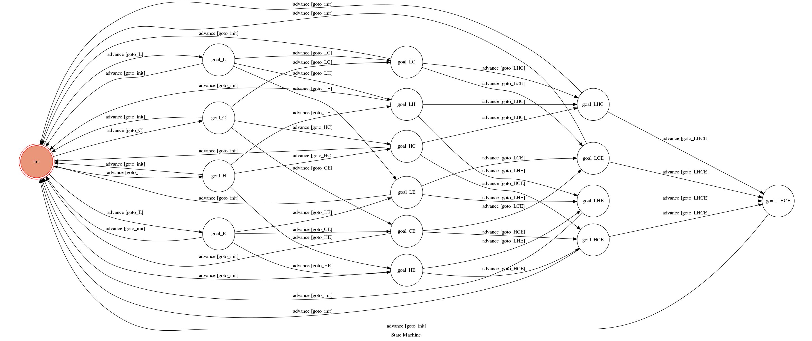

# TOC Project 2017

Code for TOC Project 2017

A telegram bot based on a finite state machine

## Setup

### Prerequisite
* Python 3

#### Install Dependency
```sh
pip install -r requirements.txt
```

#### port of ngrok
```sh
ngrok http 8443
```

#### Run

```sh
python3 app.py
```

## Finite State Machine


## Usage
The initial state is set to `init`.

Every time each state is triggered to `advance` to another state, it will go to the next state.
The Bot will choose one charactor to be in the four options.
User needs to guess which charactor the bot is now by input some actions and see what happened.
Every time it goes to a new state, it will reply which state you are now.
If you are in the final state, it will tell you which charactor it is and restart.

* user
	* Input: "itching"
		* Reply: "Ha"

	* Input: "gaming~~"
		* Reply: "yaya"

	* Input: "eating"
		* Reply: "<3"

	* Input: "sleeping"
		* Reply: "....zz"

	* Input: "daydream"
		* Reply: "...zzzzz"
	
	* Input: "attack!"
		* Reply: "yah TOT"
